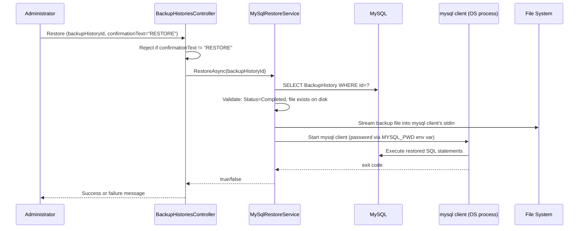

# Backup and Restore Flow

Matches `MySqlBackupService.CreateBackupAsync` and `MySqlRestoreService.RestoreAsync`
exactly.

```mermaid
sequenceDiagram
    participant U as Administrator
    participant BC as BackupHistoriesController
    participant BS as MySqlBackupService
    participant DB as MySQL
    participant P as mysqldump (OS process)
    participant FS as File System

    U->>BC: "Run Backup Now" (BackupType)
    BC->>BS: CreateBackupAsync(type, userId)
    BS->>DB: INSERT BackupHistory (Status=InProgress)
    BS->>P: Start mysqldump (password via MYSQL_PWD env var)
    P->>DB: Dump schema/data per BackupType
    P-->>BS: stdout → written to FS; exit code
    alt exit code 0 AND file exists AND size > 0
        BS->>DB: UPDATE BackupHistory SET Status=Completed, FileSize=..., CompletedAtUtc=...
    else anything else
        BS->>DB: UPDATE BackupHistory SET Status=Failed, ErrorMessage=...
    end
    BS-->>BC: BackupHistory
    BC-->>U: Success or failure message
```



A backup is only ever reported Completed if the process actually exited 0 and produced a
non-empty file — never optimistically before the process finishes. Restore requires typing
the literal word `RESTORE` in the confirmation field, in addition to the CSRF token, because
it overwrites the entire current database.
