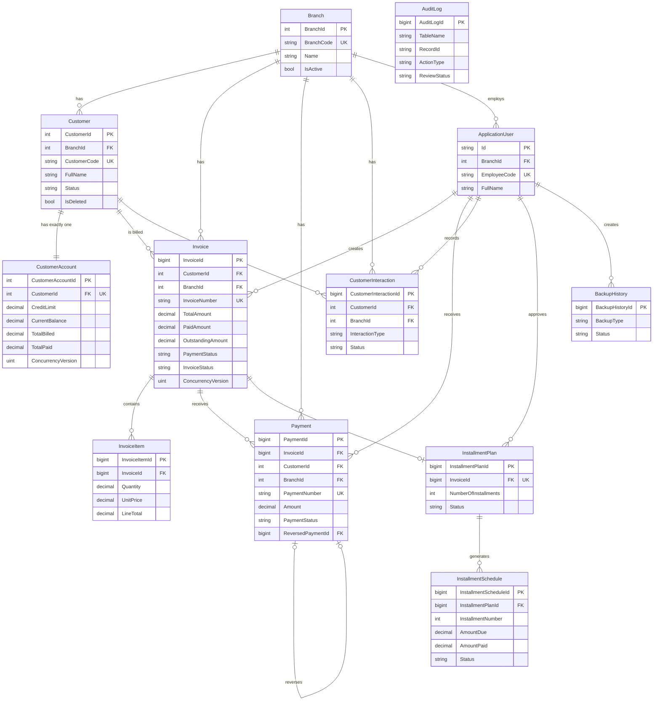

# ER Diagram

Generated from the actual EF Core Fluent API configuration
(`src/CustomerLedger.Infrastructure/Data/Configurations/`) and the InitialCreate migration —
not drawn freehand. ASP.NET Core Identity tables (AspNetRoles, AspNetUserRoles, etc.) are
omitted for readability except AspNetUsers, which every business table's audit/ownership
columns reference.

`AuditLog` intentionally has no foreign keys to `Branch`/`ApplicationUser` — audit rows must
survive even if the referenced branch or user is later changed, per
[docs/database/Delete-Behaviors.md](../database/Delete-Behaviors.md).
