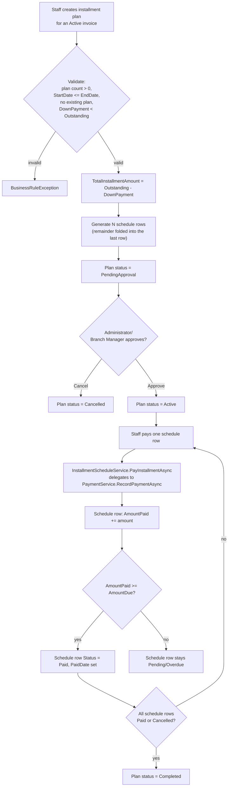

# Installment Flow

Matches `InstallmentPlanService.CreateAsync` (schedule generation) and
`InstallmentScheduleService.PayInstallmentAsync` exactly.

Overdue transition (Pending → Overdue when `DueDate` passes) is **not** part of this
diagram's event chain — it happens independently, once an hour, via
`OverdueInstallmentBackgroundService`, since no INSERT/UPDATE/DELETE event fires merely
because time passed. See [Triggers.md](../database/Triggers.md) for why this is a
background service rather than a database trigger.
