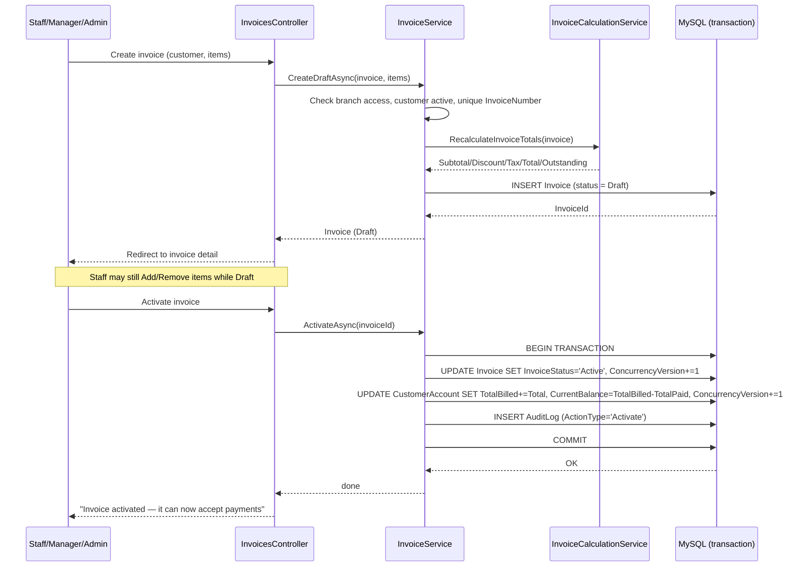

# Invoice Transaction Flow

Matches `InvoiceService.CreateDraftAsync` / `ActivateAsync` exactly.

`TotalBilled` is deliberately recognized at **Activate**, not at Draft creation — a Draft
invoice can still be freely edited or cancelled with zero financial consequence, so it must
not count toward the customer's outstanding debt until it becomes real (Active). See
`InvoiceService.CancelAsync` for the symmetric undo when an Active invoice is cancelled.
