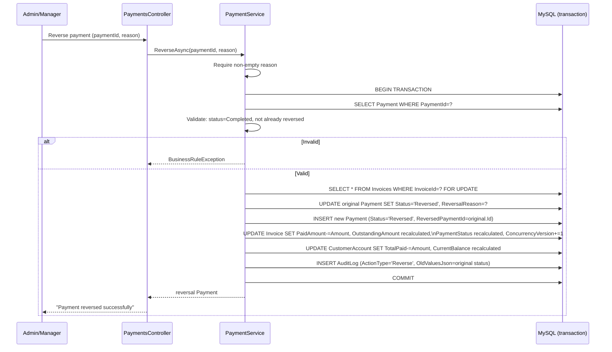

# Payment Reversal Flow

Matches `PaymentService.ReverseAsync` exactly — see also
`database/transactions/PaymentReversal.sql`.

The original payment row is **never deleted** — it is marked `Reversed` and a second,
linked row records the reversal, so the full transaction history remains traceable end to
end. `PaymentReversalTests.ReverseAsync_CalledTwice_ThrowsBusinessRuleException` proves a
payment cannot be reversed more than once.
