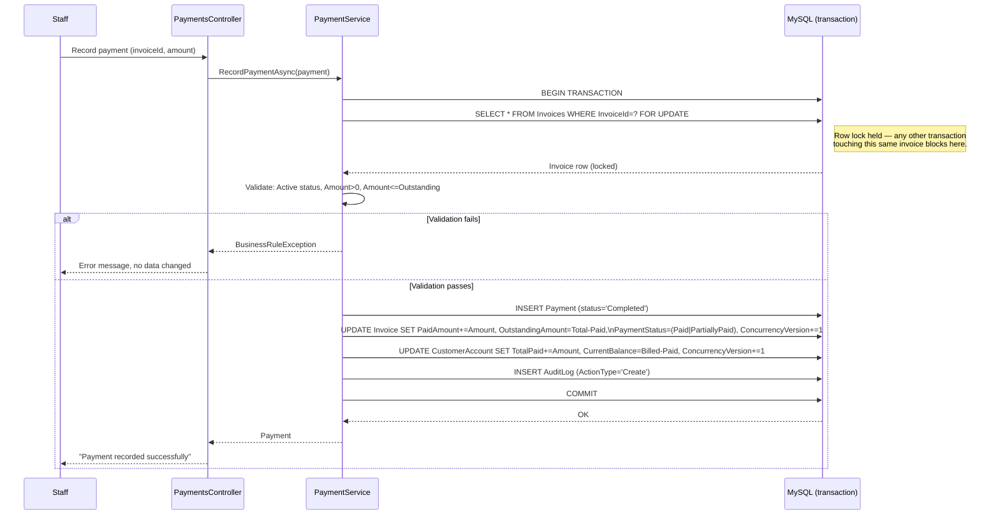

# Payment Transaction Flow

Matches `PaymentService.RecordPaymentAsync` exactly — see also
`database/transactions/PaymentTransaction.sql` and `ConcurrentPaymentTests`.



## Isolation under concurrency

```mermaid
sequenceDiagram
    participant A as Session A
    participant B as Session B
    participant DB as MySQL

    A->>DB: BEGIN; SELECT ... FOR UPDATE (Invoice #1)
    activate DB
    Note over DB: Lock held by A
    B->>DB: BEGIN; SELECT ... FOR UPDATE (Invoice #1)
    Note over B: Blocks — waits for A's lock
    A->>DB: UPDATE Invoice/Account; COMMIT
    deactivate DB
    Note over DB: Lock released
    DB-->>B: Now proceeds, sees A's committed OutstandingAmount
    B->>B: Re-validate payment.Amount <= (now-current) OutstandingAmount
    alt Would overpay
        B-->>B: BusinessRuleException — rejected
    else Still valid
        B->>DB: UPDATE Invoice/Account; COMMIT
    end
```

`ConcurrentPaymentTests.TwoConcurrentPayments_ThatWouldJointlyOverpay_OnlyOneSucceeds` is
the automated test proving this exact sequence.
