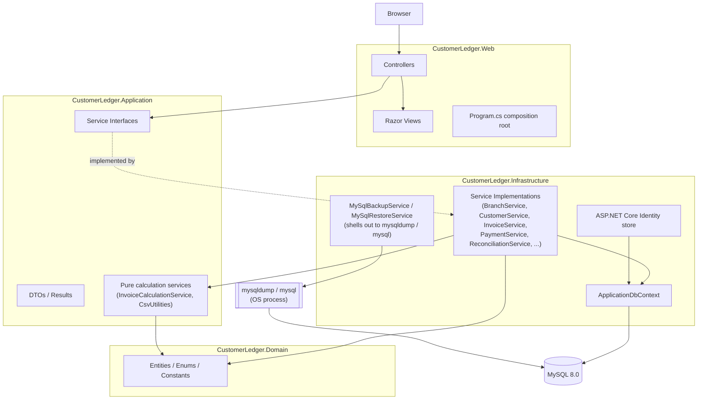

# System Architecture

**Dependency direction**: Domain has no dependency on anything else. Application depends
only on Domain. Infrastructure depends on Application and Domain (it implements
Application's interfaces). Web depends on all three but contains no business logic itself —
controllers call an injected `I...Service` and translate the result/exception into an
HTTP response.

**Why this shape**: it lets `CustomerLedger.UnitTests` exercise `InvoiceCalculationService`
and `CsvUtilities` with zero infrastructure, and lets `CustomerLedger.DatabaseTests`/
`IntegrationTests` exercise the real service implementations against a real MySQL database
without ever touching ASP.NET Core's HTTP pipeline (except for the one
`WebApplicationSmokeTests` class, which deliberately does boot the full pipeline).
