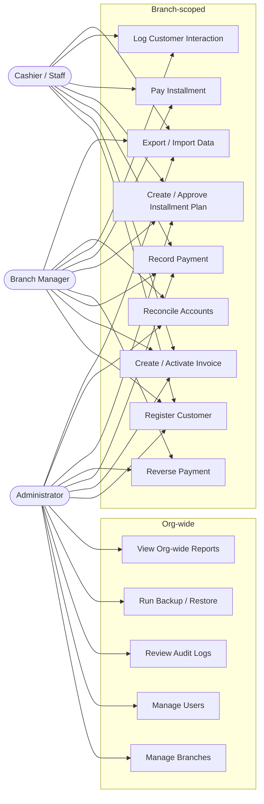

# Use-Case Diagram

UC9 (Reverse Payment) and UC10's approval step are restricted to Administrator/Branch
Manager in code — see `[Authorize(Roles = Roles.Administrator + "," + Roles.BranchManager)]`
on `PaymentsController.Reverse` and `InstallmentPlansController.Approve`. UC4 (Backup/
Restore) is Administrator-only. Every use case is additionally scoped to the actor's own
branch server-side via `ICurrentUserContext`, regardless of what this diagram's grouping
suggests about role capability alone.
